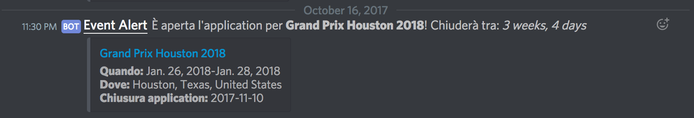

# Magic Judge Events Bot

This is a simple Discord Bot to get notified when applications are open for events you like.

It parses https://apps.magicjudges.org/events using filters defined in `config.json`, and publish it on Discord.




## Requirements
1. You need [Node.js](https://nodejs.org)
1. You need [Discord WebHook url](https://support.discordapp.com/hc/en-us/articles/228383668-Intro-to-Webhooks)
1. [Configure](#configuration) it
1. Run it with `npm start`


## How it works

On start, the script makes requests to [AppJudges' events](https://apps.magicjudges.org/events) with defined filters. It parses the contents and converts them in Event objects.

Each Event is searched inside internal database to avoid post duplications. New events will be sent to Discord using Webhook url, then will be saved in database.

## Configuration

In order to get only events you want, you must create a `config.json` file with the filters you need. Use `config.sample.json` as model.

### Events
```json
{
    "events":[{
        "types": ["GRAND_PRIX", "PRO_TOUR"]
    }, {
        "countries": ["ITALY_AND_MALTA"]
    }]
}
```

The `events` key refers to an array of requests. Each request is a combination of `types` and `countries`.

In example given, we want all GP and PT **and** all events in Italy. It will make two requests to JudgeApps to get these informations.

If we want get notified about PPTQ in USA - North, USA - Northeast and USA - Northwest, we need this config:

```json
{
    "events": [{
        "types": ["PPTQ"],
        "countries": ["USA_NORTH", "USA_NORTHEAST", "USA_NORTHWEST"]
    }]
}
```

### Discord Webhook

To publish content on Discord channel, you need the [Discord Webhook Url](https://support.discordapp.com/hc/en-us/articles/228383668-Intro-to-Webhooks). Once you have it, there are two ways to use it:
1. Define `DISCORD_WEBHOOK` key in `config.json`
```json
{
    "DISCORD_WEBHOOK": "https://discordapp.com/api/webhooks/[...]"
}
```
2. Define `DISCORD_WEBHOOK` as environment variable:
```sh
$ DISCORD_WEBHOOK=https://discordapp.com/api/webhooks/[...] npm start

# or

$ export DISCORD_WEBHOOK=https://discordapp.com/api/webhooks/[...]
$ npm start
```

### Dry run

To test your configuration, you can run bot in DRY_RUN mode. In this way, you'll get only info about what will be published.

```sh
$ DRY_RUN=1 npm start

Posting  { id: '8677',
  name: 'Grand Prix Houston 2018',
  url: 'https://apps.magicjudges.org/events/8677/',
  location: 'Houston, Texas, United States',
  eventDate: 'Jan. 26, 2018-Jan. 28, 2018',
  applicationClose: '2017-11-10',
  applicationCloseRemaining: '3 weeks, 4 days' }
```